# CMPLR
<p align="center">
  <a href="" rel="noopener">
</p>
<p align="center">  CMPLR
    <br> 
</p>
<div align="center">
  
[](https://github.com/CMPLR-Technologies/CMPLR-Frontend/contributors)
[](https://github.com/CMPLR-Technologies/CMPLR-Frontend/issues)
[](https://github.com/CMPLR-Technologies/CMPLR-Frontend/network)
[](https://github.com/gaserashraf/CMPLR-Frontend/stargazers)
[](https://github.com/CMPLR-Technologies/CMPLR-Frontend/blob/master/LICENSE)

</div>


## 📝 Table of Contents

- [About](#about)
- [Get Started](#Install)
- [Technology](#tech)
- [Screenshots](#Screenshots)
- [file structure](#file)

## 📙 About <a name = "about"></a>
Responsive Frontend which mocks tumbler ui/ux.

## 🏁 Get Started <a name = "Install"></a>
1. **Clone the repository**
```
git clone https://github.com/gaserashraf/CMPLR-Frontend.git
```
```
cd CMPLR-Frontend
```
2. **Running**
```
npm i
```
```
npm start
```
go to your browser and go to http://localhost:5000/

## 💻 Built Using <a name = "tech"></a>
- **React.js**
- **Docker**
- **Jest**
- **webpack**
- **NPM**
- **SASS**
## 📷 Demo Screenshots 

<div name="Screenshots" align="center">
   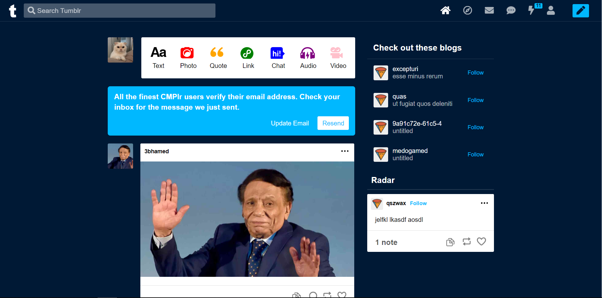</a>
   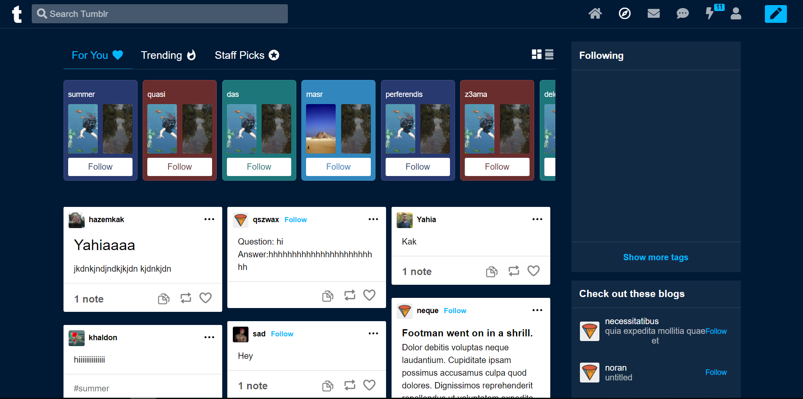</a>
   <hr>
   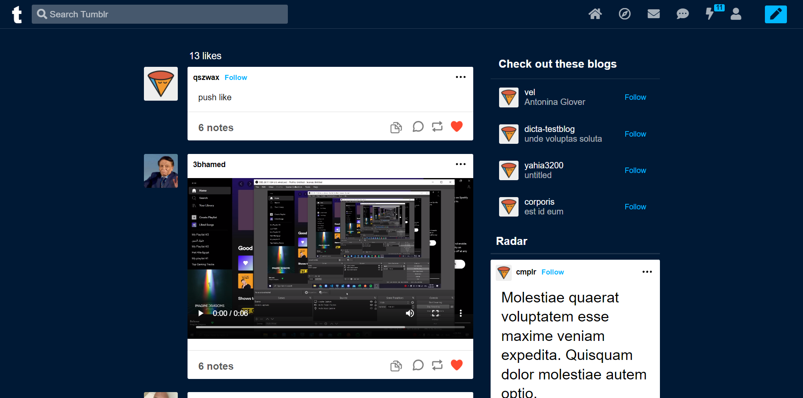</a>
   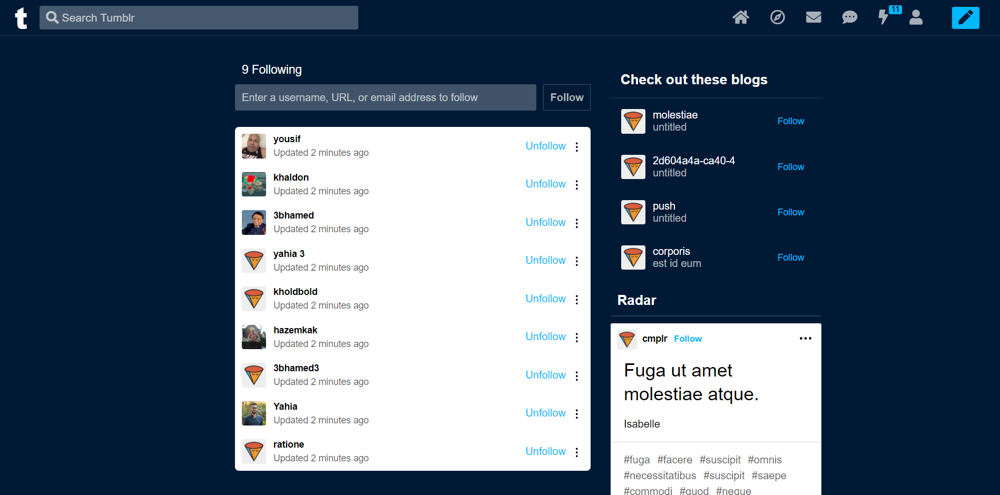</a>
   <hr>
   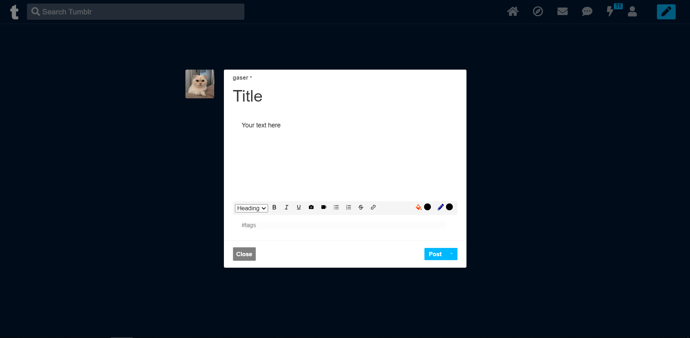</a>
   <hr>
   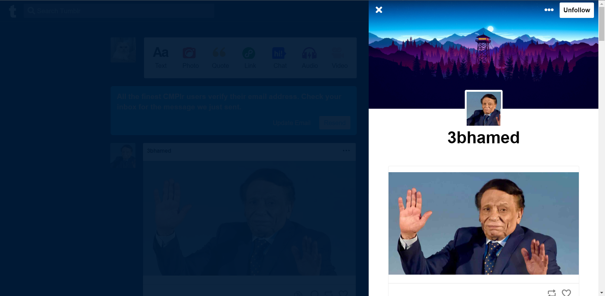</a>
   <hr>
   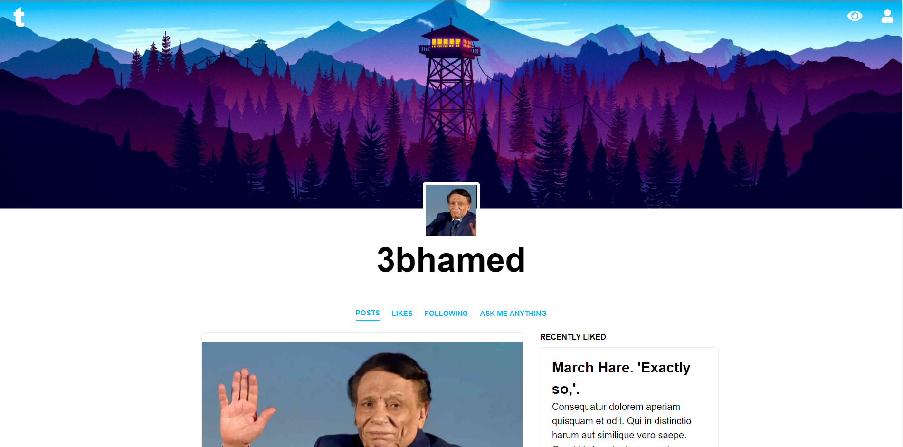</a>
   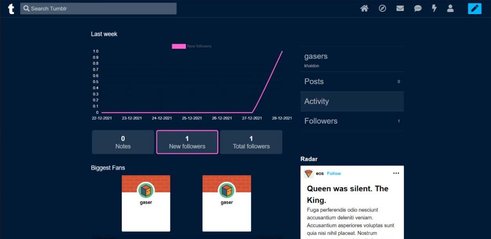</a>
   <hr>
   <h2 align='left'>9 themes</h2>
   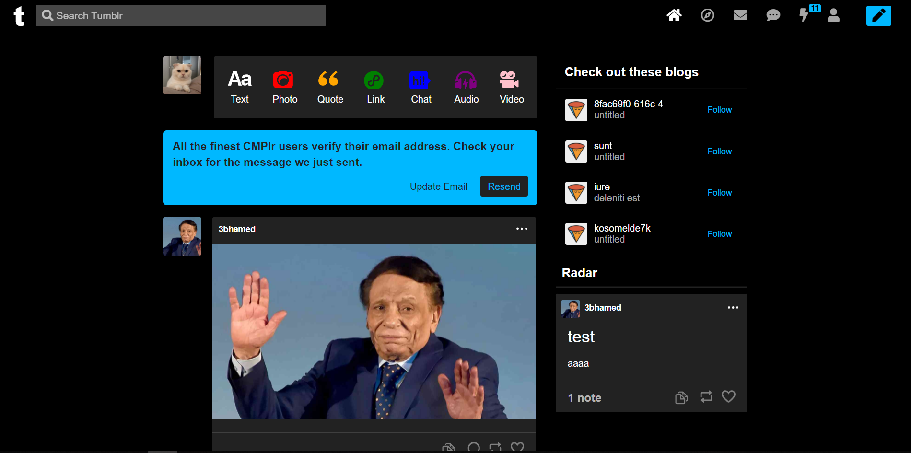</a>
   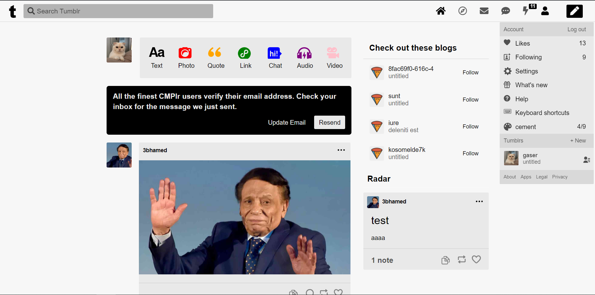</a>
   <hr>
   <h2 align='left'>resopnsive</h2>
   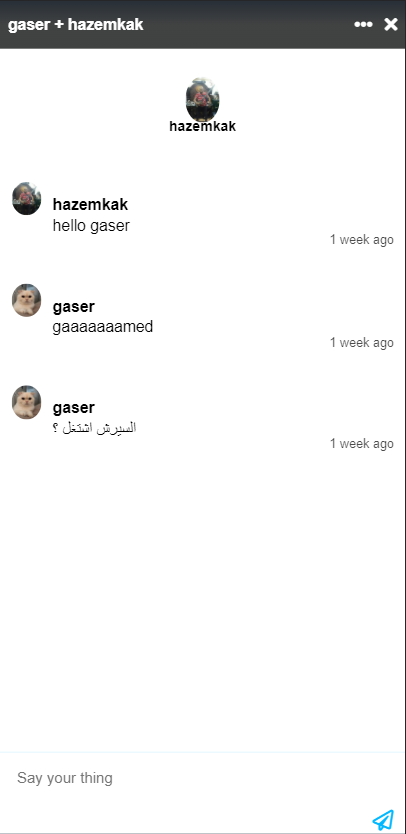</a>
   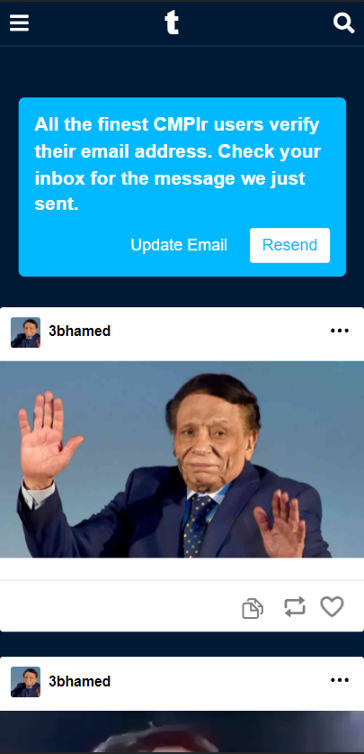</a>
   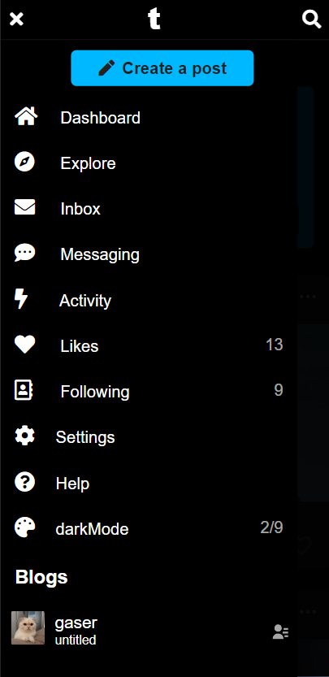</a>
   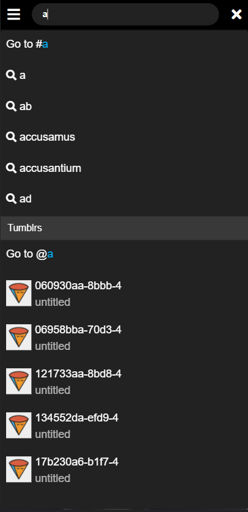</a>
   <hr>
   
   
</div>


## Videos
  <a src='https://drive.google.com/drive/folders/16V4ifbCAqpNqFoK3_zdZmXNxinvTYb5b'>Player</a>
## File Structure <a name = "file"></a>
```
|-- 
    |-- src
    |   |-- App.js
    |   |-- App.testjs
    |   |-- config.json
    |   |-- dockerfile
    |   |-- index.js
    |   |-- reportWebVitals.js
    |   |-- setupTests.js
    |   |-- assets
    |   |-- components
    |   |   |-- ThemeToggle.jsx
    |   |   |-- forgetPasswordComponent
    |   |   |   |-- ForgetPassword.test.js
    |   |   |   |-- View.jsx
    |   |   |   |-- containers
    |   |   |       |-- ForgetPassword.jsx
    |   |   |       |-- ResetPassword.jsx
    |   |   |-- homeComponent
    |   |   |   |-- Controller.js
    |   |   |   |-- Home.test.js
    |   |   |   |-- View.jsx
    |   |   |   |-- containers
    |   |   |       |-- Sec1
    |   |   |       |   |-- Button.jsx
    |   |   |       |   |-- ExploreBtn.svg.jsx
    |   |   |       |   |-- Footer.jsx
    |   |   |       |   |-- GoogleButton.svg.jsx
    |   |   |       |   |-- HomeSec1.jsx
    |   |   |       |-- Sec2
    |   |   |       |   |-- Background.svg.jsx
    |   |   |       |   |-- HomeSec2.jsx
    |   |   |       |-- Sec3
    |   |   |       |   |-- HomeSec3.jsx
    |   |   |       |-- Sec4
    |   |   |       |   |-- HomeSec4.jsx
    |   |   |       |-- Sec5
    |   |   |       |   |-- Audio.svg.jsx
    |   |   |       |   |-- Chat.svg.jsx
    |   |   |       |   |-- HomeSec5.jsx
    |   |   |       |   |-- Link.svg.jsx
    |   |   |       |   |-- Photo.svg.jsx
    |   |   |       |   |-- PostType.jsx
    |   |   |       |   |-- Quote.svg.jsx
    |   |   |       |   |-- Text.svg.jsx
    |   |   |       |   |-- Video.svg.jsx
    |   |   |       |-- SideNav
    |   |   |           |-- CircledNavLink.jsx
    |   |   |           |-- SideNav.jsx
    |   |   |-- loginComponent
    |   |   |   |-- Controller.jsx
    |   |   |   |-- Login.test.js
    |   |   |   |-- Service.jsx
    |   |   |   |-- View.jsx
    |   |   |   |-- containers
    |   |   |       |-- LoginCard.jsx
    |   |   |-- navbarComponent
    |   |   |   |-- Controller.js
    |   |   |   |-- Navbar.test.js
    |   |   |   |-- View.jsx
    |   |   |   |-- containers
    |   |   |       |-- navbarLinks
    |   |   |       |   |-- NavbarLinks.jsx
    |   |   |       |   |-- links
    |   |   |       |   |   |-- AuthLinks.jsx
    |   |   |       |   |   |-- UnAuthLinks.jsx
    |   |   |       |   |-- MessagesPopup
    |   |   |       |   |   |-- MessageItem.jsx
    |   |   |       |   |   |-- Messages.jsx
    |   |   |       |   |   |-- MessagesContainer.jsx
    |   |   |       |   |   |-- MessagesPageMobile.jsx
    |   |   |       |   |   |-- MessagesPopUp.jsx
    |   |   |       |   |   |-- SearchNewMessage.jsx
    |   |   |       |   |-- newPost
    |   |   |       |       |-- NewPostPopup.jsx
    |   |   |       |       |-- NewPostPopupItem.jsx
    |   |   |       |-- searchBar
    |   |   |       |   |-- SearchBar.jsx
    |   |   |       |   |-- searchBarResults
    |   |   |       |       |-- SearchResult.jsx
    |   |   |       |       |-- SearchResultItemBlog.jsx
    |   |   |       |       |-- SearchResultItemContent.jsx
    |   |   |       |-- section1
    |   |   |           |-- NavbarMenuMobile.jsx
    |   |   |           |-- NavbarSection1.jsx
    |   |   |           |-- Section1.jsx
    |   |   |-- partials
    |   |   |   |-- AuthAlert.jsx
    |   |   |   |-- AuthBtn.jsx
    |   |   |   |-- AuthFooter.jsx
    |   |   |   |-- AuthInput.jsx
    |   |   |   |-- MockedComponent.jsx
    |   |   |   |-- OrBar.jsx
    |   |   |   |-- PlaystoreApplestore.jsx
    |   |   |-- registerComponent
    |   |   |   |-- Register.test.js
    |   |   |   |-- View.jsx
    |   |   |   |-- containers
    |   |   |       |-- RegisterCard.jsx
    |   |   |       |-- RegisterStepOne.jsx
    |   |   |       |-- RegisterStepTwo.jsx
    |   |   |-- resetPasswordComponent
    |   |   |   |-- ResetPassword.test.js
    |   |   |   |-- View.jsx
    |   |   |   |-- containers
    |   |   |       |-- ResetPasswordCard.jsx
    |   |   |-- routes
    |   |   |   |-- Routes.jsx
    |   |   |-- shortcuts
    |   |       |-- shortcutController.js
    |   |       |-- shortcuts.test.js
    |   |       |-- View.jsx
    |   |       |-- containers
    |   |           |-- Shortcut.jsx
    |   |           |-- ShortcutGroup.jsx
    |   |           |-- ShortcutsContainer.jsx
    |   |-- contexts
    |   |   |-- themeContext
    |   |   |   |-- ThemeContext.js
    |   |   |-- userContext
    |   |       |-- UserContext.js
    |   |-- styles
    |   |   |-- styles.css
    |   |   |-- styles.css.map
    |   |   |-- scss
    |   |       |-- styles.scss
    |   |       |-- forgetPasswordStyles
    |   |       |   |-- _forgetPasswordStyles.scss
    |   |       |-- homeStyles
    |   |       |   |-- _homeStyles.scss
    |   |       |-- loginStyles
    |   |       |   |-- LoginCard.scss
    |   |       |   |-- LoginView.scss
    |   |       |-- navbarComponent
    |   |       |   |-- _Navbar.scss
    |   |       |-- partials
    |   |       |   |-- authAlert.scss
    |   |       |   |-- AuthBtn.scss
    |   |       |   |-- AuthFooter.scss
    |   |       |   |-- AuthInput.scss
    |   |       |   |-- OrBar.scss
    |   |       |   |-- _authAlert.scss
    |   |       |-- registerStyles
    |   |       |   |-- exploreAnchor.scss
    |   |       |   |-- _exploreAnchor.scss
    |   |       |-- shortcutsStyles
    |   |           |-- shortcuts.scss
    |   |-- __mock_database
    |       |-- db.json
```
## ✨ Contributors
<table>
  <tr>
  <td align="center"><a href="https://github.com/Hazemkak"><br /><sub><b>Hazem Kasim</b></sub></a><br /></td>
    <td align="center"><a href="https://github.com/gaserashraf"><br /><sub><b>Gaser Ashraf</b></sub></a><br /></td>
    <td align="center"><a href="https://github.com/AhmedKhaled590"><br /><sub><b>Ahmed Khaled</b></sub></a><br /></td>
    <td align="center"><a href="https://github.com/yahia3200"><br /><sub><b>yahia zakaria</b></sub></a><br /></td>
    <td align="center"><a href="https://github.com/hoskillua"><br /><sub><b>hossam saaed</b></sub></a><br /></td>
    <td align="center"><a href="https://github.com/HazemAbdo"><br /><sub><b>Hazem abdo</b></sub></a><br /></td>
  </tr>
 </table>


